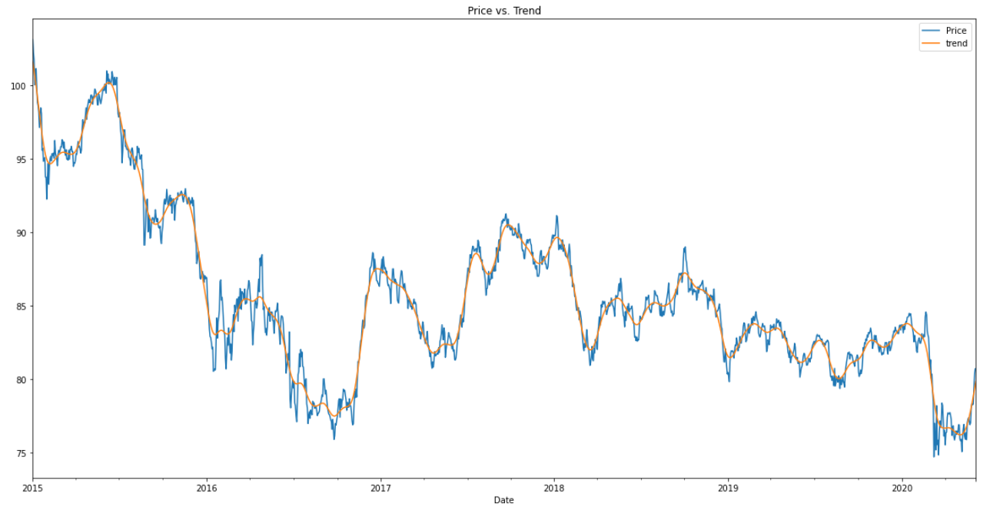
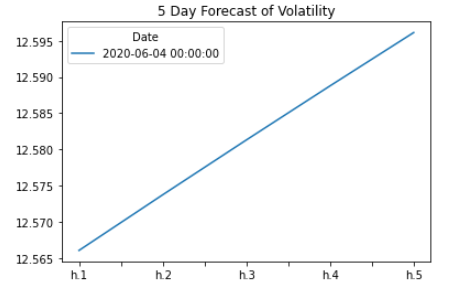
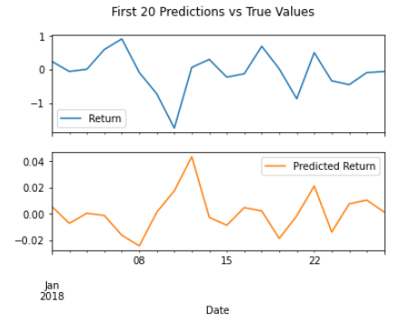

# Unit 10 - A Yen for the Future

## Background

When doing international business, large firms' financial departments frequently have to undertake foreign currency transactions, and hedge funds are interested in anything that can give them an advantage in anticipating currency changes. As a result, both are always keen to learn more about various currencies' future directions and dangers.

In this project, I used different time series tools to anticipate future movements in the value of the Canadian dollar vs the Japanese yen.

- - -

### Files

[Time-Series Starter Notebook](My_Code/time_series_analysis.ipynb)

[Linear Regression Starter Notebook](My_Code/regression_analysis.ipynb)

[CAD/JPY Data CSV File](My_Code/cad_jpy.csv)

- - -

#### Time-Series Forecasting

You'll find historical CAD-JPY exchange rate data in this notebook, as well as time series analysis and modelling to see whether there's any predictable behaviour.

* Plotting the Settle price to check for long or short-term patterns
   
* Decomposition using a Hodrick-Prescott filter

    
* Forecasting returns using an ARMA model
    
* Forecasting the exchange rate price using an ARIMA model
    
* Forecasting volatility with GARCH
   

#### Linear Regression Forecasting

A Scikit-Learn linear regression model to forecast CAD/JPY returns with *lagged* CAD/JPY futures returns and categorical calendar seasonal factors is included in this notebook (e.g., day-of-week or week-of-year seasonal effects).

* Data preparation (creating returns and lagged returns, and splitting the data into training and testing data)

* Fitting a linear regression model

* Making predictions using the testing data

* Out-of-sample performance

* In-sample performance

- - -

### Conclusions

Based on my time series analysis, I would not buy the yen now due to the forecasts predicting the price to fall and volatility to increase.

I would not use the ARMA and ARIMA models due to their poor results. The GARCH model has substantially lower p-values, showing a superior model performance overall, and I would feel confident using it.

The RMSE out-of-sample is lower than the RMSE in-sample. The RMSE is usually lower for training data, however in this case it is higher.

- - -

### Built With

* pandas

* numpy

* pathlib

* sklearn

* statsmodels

* arch

- - -
